# Viridian Square

Welcome to Viridian Square - the natural meeting place for artists and art lovers!

Named after a well known artist pigment, Viridian green, the platform is tailored for the needs of artists and art lovers.

---

**Table of content**

- [Planning and methodology](#planning)
    - [Site goals and strategy](#strategy)
    - [Database ERD](#erd)
    - [Map of API CRUD functionality](#api-plan)
    - [API endpoints](#api-endpoints)
    - [Surface plane Design](#surface-plane-design)
        - [Colours](#colours)
        - [Fonts](#fonts)
        - [Logo](#logo)
        - [Low fidelity wireframes](#basic-wireframes)
        - [Design wireframes](#design-wireframes)
    - [Agile methodology](#agile-methodology)
    - [User stories](#user-stories)
    - [Future improvements](#future-improvements)
- [Features](#features)
- [Tools and technologies](#tools-and-technologies)
- [Repository description](#repo-description)
- [Deployment](#deployment)
- [Testing](#testing)
- [Bugs](#bugs)
- [Credits](#credits)
- [Acknowledgements](#acknowledgements)

---

<a id="planning"></a>
## Planning and methodology

<a id="strategy"></a>
## Site goals and strategy

Viridian sq. (Viridian square) provides a meeting place tailored for the needs of artists and art lovers.

Artists can set up their own gallery, presenting their art pieces in a visually appealing way, with relevant information. Artists also have the option to group art pieces into collections, so that related art pieces can be viewed together, as intended.

Art lovers can use the platform to discover their next find. They can search for art pieces by the works’ title, collection title, artist name, or hashtags. To make the search more efficient, they can also apply filters for art mediums used (eg. oil or watercolour), and sort the results.

If an art buyer finds what they are looking for, and the artist has indicated an interest in selling the piece, an enquiry can be made. If accepted, the artist’s contact details are shared with the potential buyer, connecting the two.

The goal of the site is to help independent artists to increase their visibility, and their chance to get their art noticed by potential buyers, while providing a dedicated platform for art lovers to discover new art and artists.

<a id="erd"></a>
### Database ERD
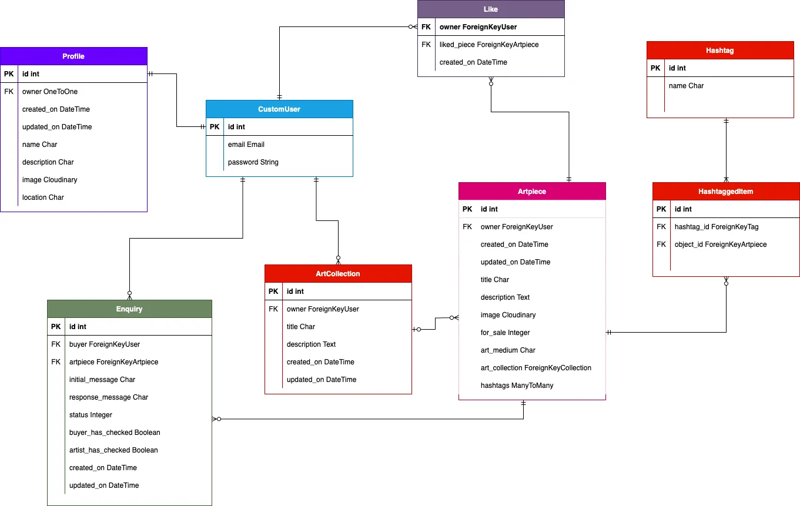

<a id="api-plan"></a>
### Map of API CRUD functionality

| Model | Endpoints | Create | Read | Update | Delete | Filter | Text search |
| - | - | - | - | - | - | - | - |
| CustomUser | dj-rest-auth/registration<br>dj-rest-auth/user<br>update-email/<br>delete-user/ | Y | Y | Y | Y | N | N |
| Profile | profiles/<br>profiles/:id/ | Y (signals) | Y | Y | Y (signals) | N | N |
| Artpiece | artpieces/<br>artpieces/:id/<br>artpieces/trending/ | Y | Y | Y | Y | owner<br>liked<br>for_sale_status<br>collection<br>art_medium | title<br>collection title<br>profile_name<br>hashtag |
| Like | likes/<br>likes/:id/ | Y | Y | N | Y | owner | N |
| Enquiry | enquiries/<br>enquiries/:id/ | Y | Y | Y | Y | user (buyer)<br>user (artpiece owner) | N |
| Hashtag | artpieces/<br>artpieces/:id/ | Y* | N | N | N | N | N |
| ArtCollection | collections/<br>collections/:id/<br>collections/:id/update-artpieces | Y | Y | Y | Y | owner | N |

*Hashtag creation is nested within Artpiece creation/updating


<a id="api-endpoints"></a>
### API Endpoints

| Endpoint | GET | POST | PUT | DELETE | Permissions | Usage |
| - | - | - | - | - | - | - |
| dj-rest-auth/registration | - | Y | - | - | - | Sign up (creates CustomUser and Profile) |
| dj-rest-auth/login | - | Y | - | - | - | Log in |
| dj-rest-auth/logout | - | Y | - | - | IsAuthenticated | Log out |
| dj-rest-auth/user | Y | - | - | - | IsAuthenticated | Retrieve user details |
| dj-rest-auth/token/refresh | - | Y | - | - | IsAuthenticated | Refresh token |
| delete-user/ | - | - | - | Y | IsAuthenticated | Delete user |
| update-email/ | - | - | Y | - | IsAuthenticated | Update user email |
| profiles/ | Y | - | - | - | - | List profiles |
| profiles/:id/ | Y | - | Y | - | IsOwnerOrReadOnly | Retrieve and update profile |
| artpieces/ | Y | Y | - | - | IsAuthenticatedOrReadOnly | List and create artpieces |
| artpieces/:id/ | Y | - | Y | Y | IsOwnerOrReadOnly | Retrieve artpiece by id, update and delete artpiece |
| artpieces/trending/ | Y | - | - | - | - | Retrieve artpieces with most likes in last 30 days |
| likes/ | Y | Y | - | - | IsAuthenticatedOrReadOnly | Retrieve a list of likes, create a like |
| likes/:id/ | Y | - | - | Y | IsOwnerOrReadOnly | Retrieve a like by id, delete a like |
| collections/ | Y | Y | - | - | IsAuthenticatedOrReadOnly | Retrieve a list of collections, create a collection |
| collections/:id/ | Y | - | Y | Y | IsOwnerOrReadOnly | Retrieve a collection by id, edit and delete a collection |
| collections/:id/update-artpieces/ | - | Y | - | - | IsOwner | Bulk add artpieces to an art collection |
| enquiries/ | Y | Y | - | - | IsAuthenticatedOrReadOnly | Retrieve enquiries associated to the requesting user, create an enquiry |
| enquiries/:id/ | Y | - | Y | Y | IsBuyerOrArtist | Retrieve an enquiry by id, update, and soft delete an enquiry |


<a id="surface-plane-design"></a>
### Surface plane design

<a id="colours"></a>
#### Colour scheme

Preliminary colour scheme: The primary brand colour, #40826, Viridian green, will be included. The other colours may be adjusted at a later stage in the project.

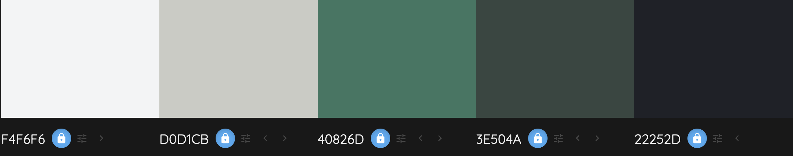

<a id="fonts"></a>
#### Fonts

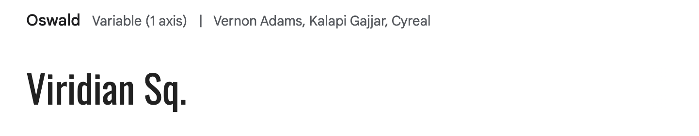

For headings, and used in logo

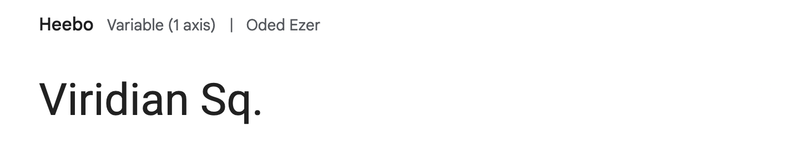

For normal text


<a id="logo"></a>
#### Logo

Logo, black on transparent background:


<a id="basic-wireframes"></a>
#### Low fidelity wireframes
- [Desktop wireframes](documentation/wireframes/viridian-wireframes.pdf)
- [Tablet](documentation/wireframes/viridian-wireframes-tablet.pdf)
- [Mobile](documentation/wireframes/viridian-wireframes-mobile.pdf)

#### Design wireframes
An additional wireframe was created to test out the colour scheme and intended style of the website.

- [Design wireframe, home page (Discover page)](documentation/design/design-wireframe.pdf).

<a id="agile-methodology"></a>
### Agile methodologies

#### Sprint 1:
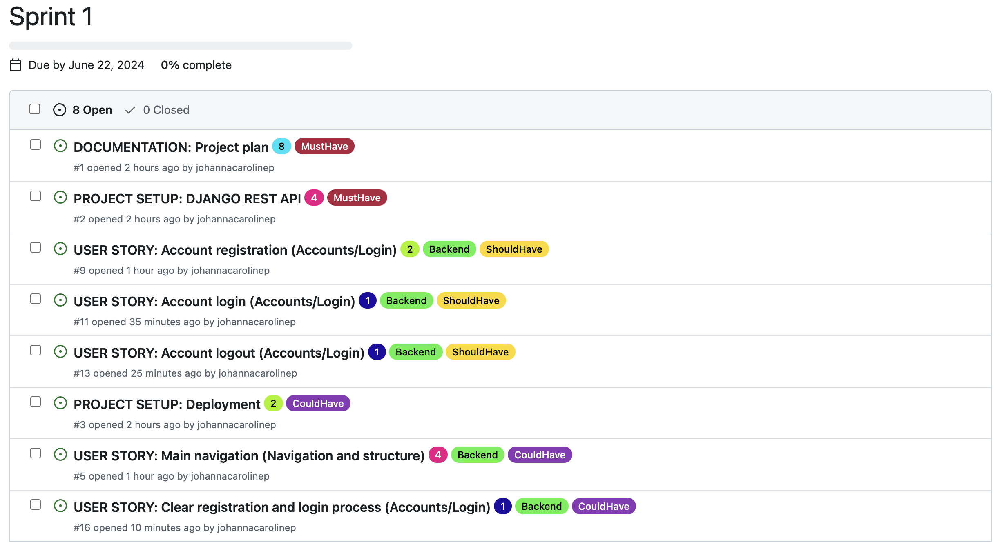

##### Sprint 1 wrap-up:

Project board at end of sprint 1:

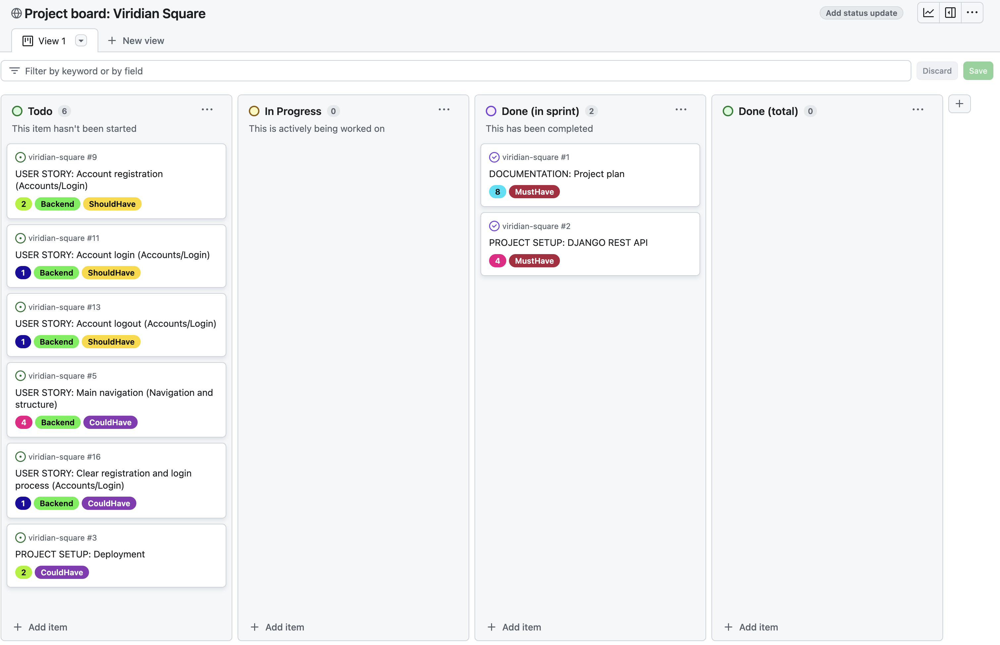

Points completed: 12

**Actions**
- Moved 6 PBI's back to the backlog.
- Reprioritised backlog.

#### Sprint 2:

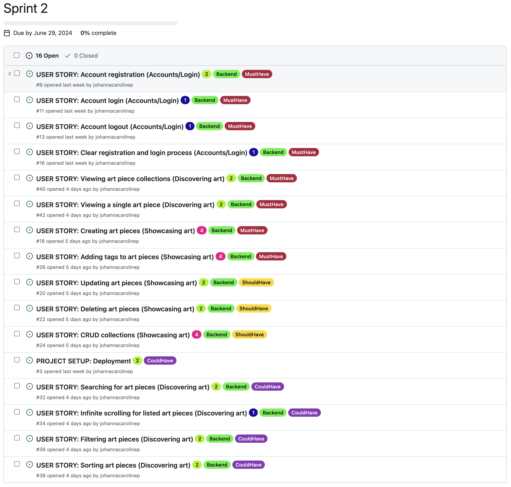

##### Sprint 2 wrap-up:

Project board at end of sprint 2:

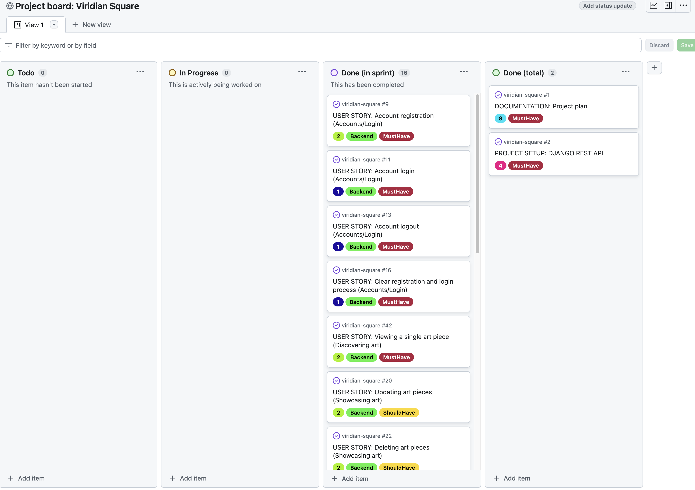

Points completed: 34

Velocity: 23

Actions taken:
- Added one new PBI to the backlog:
    - `REFACTOR`: Review potential refactoring of code in artpieces/serializers.py.
    - This action was added as I currently have methods relating to the Hashtag model in the serializer for the Artpiece model, and believe refactoring could lead to better separation of concerns and better adherence to best practice.

#### Sprint 3:

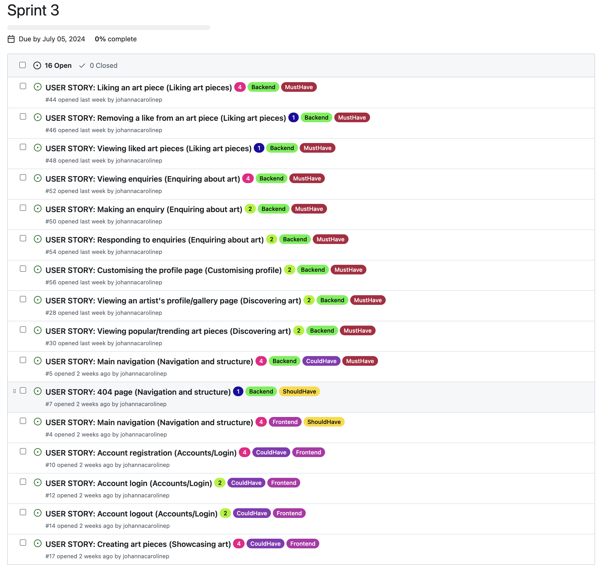

##### Sprint 3 wrap-up:

Project board at end of sprint 3:

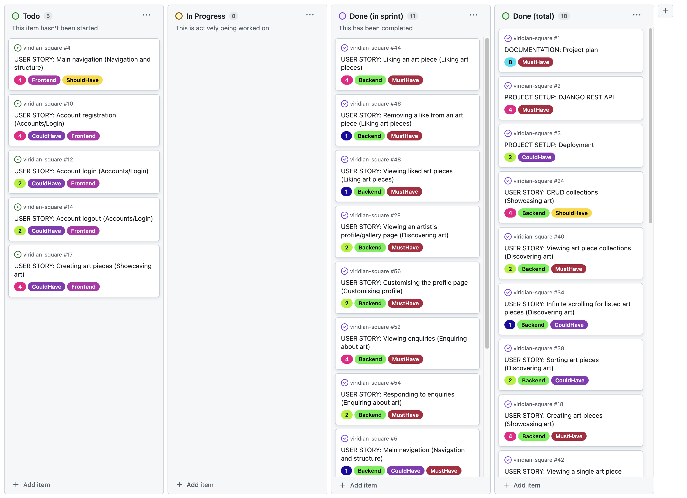

Points completed: 22

Velocity: 22.7

Reflections/Notes:

While working on a user story related to editing the user profile, I made several important changes:

1. **Removed the 'Username' Field:**
    - I eliminated the `username` field from the `CustomUser` model to prevent confusion with the `name` field in the `Profile` model.
    - This meant better separation of concerns, where `CustomUser` is focused on authorisation, while `Profile` manages the user’s public “display information”.
2. **Temporary generated value for `name`:**
    - During user sign-up, a Profile is automatically created with a temporary `name` value of "Newuser" followed by the first 8 characters of a UUID.
3. **New (unplanned) endpoints:**
    - Implemented endpoints for updating the user’s email address and deleting a user to allow the user better control over their data.

Due to time constraints, I did not create new user stories for these changes but directly implemented them within Sprint 3. Ideally, user stories should have been written and added to the backlog for future sprints. However, I felt this would impact my ability to finish the project on time and therefore made an exception.

The ERD and API documentation have been updated to reflect these changes.


Actions taken:
- 5 PBI's moved back to the backlog
- Reprioritised backlog in preparation for sprint 4.

#### Sprint 4

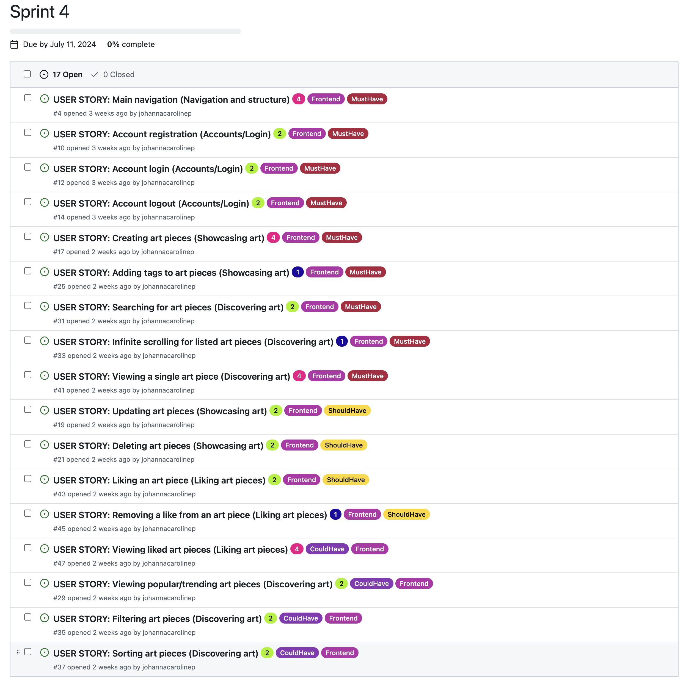


<a id="user-stories"></a>
### User stories:

**Epics**

1. Navigation and structure
2. Accounts/Login
3. Showcasing art
4. Discovering art
5. Liking art pieces
6. Enquiring about art
7. Customising profile
8. Accessibility


#### Navigation and structure
- `Main navigation:`  As a __Site User__, I can __always see the main navigation options on the top of the page,__ so that I can __easily and intuitively find my way around the website__.
- `404 page:` As a __Site User__ I can __see an informative 404 page guiding me back to the main page if I visit a page that does not exist by mistake__ so that I can __easily get back to the home page with minimal disruption.__
- `Favicon:` As a __Site User__ I can __see the website's favicon__ so that I can __easily find the website if I have multiple tabs open__.

#### Accounts/Login
- `Account registration:` As a __Site User__, I can __register an account with a username and password__ so that I can __like art pieces, make enquiries, and set up a gallery.__
- `Account login:`  As a __registered Site User__, I can __log in__ so that I can __fully engage with the platform, by e.g. posting art or making enquiries__.
- `Account logout:` As a __Logged-in User__, I can __log out__ so that I can __feel safe in that others cannot access my credentials.__
- `Clear registration and login process:` As a __Site User__, I can see __clear instructions, and get feedback and/or confirmation__ when using the forms to register/login/log out, so that I can __sign up/log in without unnecessary problems and enjoy the experience.__

#### Showcasing art
- `Creating art pieces`: As a **logged-in user**, I can **create an art piece, including an image and details (e.g., title)**, so that I can **showcase my art.**
- `Updating art pieces`: As a **logged-in user**, I can **update my own art piece**, so that I can **manage my own content**.
- `Deleting art pieces`: As a **logged-in user**, I can **delete my own art piece**, so that I can **manage and be in control of my own content.**
- `CRUD collections`: As a **logged-in user**, I can **create, update and delete collections**, so that I can **group related art pieces and present my art in a way that makes sense to me.**
- `Adding tags to art pieces`: As a **logged-in user**, I can **add tags to my own art piece**, so that I can **increase the searchability of my art**.

#### Discovering art
- `Viewing an artist's profile/gallery page`: As a **Site User**, I can **visit an artist's profile page/gallery page**, so that I can **view all art pieces and collections published by the artist in one place.**
- `Viewing popular/trending art pieces`:  As a **Site User**, I can **see popular/trending art pieces in a dedicated section on the discovery page** so that **I can get inspired to engage further and discover new great pieces.**
- `Searching for art pieces`: As a **Site User**, I can **search based on artist, title, collection title, and tags**, so that I can **find art pieces matching my criteria.**
- `Infinite scrolling for listed art pieces`: As a **Site User viewing a large number of art pieces in a list, the list is shown using infinite scroll**, so that **I do not need to navigate to separate pages**.
- `Filtering art pieces`: As a **Site User**, I can **filter the art pieces in a list view** so that I can **more easily find the pieces I am looking for and narrow down the results.**
- `Sorting art pieces`: As a **Site User**, I can **sort the art pieces in a list view (search results)** so that I can **more easily find the pieces I am looking for.**
- `Viewing art piece collection`: As a **Site User viewing an individual art piece**, I can **see if the art piece belongs to a collection**, so that I can **easily find art pieces similar to the one I am viewing.**
- `Viewing a single art piece`: As a **Site User**, I can **click on an art piece in a list** so that I can **see a detailed view of the art piece.**

#### Liking art pieces
- `Liking an art piece`: As a **logged-in site user**, I can **like an art piece**, so that I can **show appreciation to the artist and so that I can more easily find my way back to art pieces I enjoy.**
- `Removing a like from an art piece`: As a **logged-in site user who has liked an art piece**, I can **remove my like**, so that I can **change my mind or correct my mistake.**
- `Viewing liked art pieces`:  As a **logged-in site user**, I can **visit the “Liked” page**, so that I can **view all art pieces that I have liked.**

#### Enquiring about art
- `Making an enquiry`: As a **logged-in site user viewing an art piece which has been marked as for sale by the artist**, I can **make an enquiry**, so that I can **express my wish to connect with the artist.**
- `Viewing enquiries`: As a **logged-in site user who has made/received an enquiry**, I can **view the enquiry and its status on the enquiries page**, so that I can **keep track of my enquiries.**
- `Responding to enquiries`: As a **logged-in site user who has received an enquiry from a potential buyer**, I can **respond to the enquiry on the enquiries page**, so that I can **decide if my contact details will be shared with the potential buyer.**

#### Customising profile
- `Customising the profile page:` As a **logged-in user**, I can **customise my profile page/gallery page**, so that I can **better present who I am as an artist/art buyer.**

#### Accessibility
- `Navigate the website with keyboard`: As a **Site User not able to utilise a mouse** I can **focus on and access all interactive elements on the website using a keyboard** so that I can **be included, navigate on the website, access the content, and use all core functionality**.


<a id="planning"></a>
## Bugs

### BUG: 2024-07-07: Connection Refused error for POST request to live DB /dj-rest-auth/registration/.

**Issue:**

When making a POST request to the `/dj-rest-auth/registration/` endpoint on my live database, I encountered the following error:

```
ConnectionRefusedError: [Errno 61] Connection refused
[07/Jul/2024 14:15:14] "POST /dj-rest-auth/registration/ HTTP/1.1" 500 199724
```

This issue did not occur when using the local SQLite3 database.

**Steps taken:**

Researching the issue online, I found this [thread](https://github.com/pennersr/django-allauth/issues/1843), which suggested that Django was attempting to send a verification email, causing the connection refused error. This seemed plausible as I had customised the user model and made the email field mandatory.

**Solution:**
Following the advice from the thread, I added the following setting to `settings.py`:

```
ACCOUNT_EMAIL_VERIFICATION = "none"
```

This resolved the issue, and I was able to successfully register a user without encountering the error.


### BUG: 2024-07-01: Removing the `username` field from `CustomUser`.

**Background:** 

I wanted to remove the `username` field from my `CustomUser` model since I am using email for authentication and the `username` would not be used elsewhere in the app.

**Issue:**

After removing the `username` field and any references to it, I encountered the following error during migration:

```
django.core.exceptions.FieldDoesNotExist: CustomUser has no field named 'username'
```

**Steps taken:**

1. Initially, I reset the database by deleting the `SQLite3` file, removing migration files, creating new migrations, and migrating. This did not resolve the issue.
1. I identified that the errors were related to `dj_rest_auth` and `django-allauth` expecting a `username` field by default.
1. Based on online research, I added the following configuration to `settings.py` (source: [StackOverflow - *How to remove username field in the register form on django admin?*](https://stackoverflow.com/questions/36094342/how-to-remove-username-field-in-the-register-form-on-django-admin)):

```
ACCOUNT_AUTHENTICATION_METHOD = 'email'
ACCOUNT_USER_MODEL_USERNAME_FIELD = None
ACCOUNT_EMAIL_REQUIRED = True
ACCOUNT_USERNAME_REQUIRED = False
```

**Solution:**

1. Adding the above configuration informed `django-allauth` not to expect a `username` field.
1. After updating `settings.py`, I successfully ran migrations and confirmed the creation of `CustomUser` instances in the Django Admin panel.


<a id="credits"></a>
## Credits

- [Customising the user model - Django documentation](https://docs.djangoproject.com/en/5.0/topics/auth/customizing/#a-full-example)
- [Installation dj-rest-auth](https://dj-rest-auth.readthedocs.io/en/latest/installation.html)
- [m2m_changed signals - Django documentation](https://docs.djangoproject.com/en/5.0/ref/signals/#m2m-changed) - Used for removing orphaned hashtags
- [Stack Overflow - Efficiently delete orphaned m2m objects/tags in Django](https://stackoverflow.com/questions/10609699/efficiently-delete-orphaned-m2m-objects-tags-in-django)
- [Code Institute resource: Creating a new React app in an existing DRF workspace](https://code-institute-students.github.io/advfe-unified-workspace/creating-an-app-in-a-workspace/00-creating-an-app-in-a-workspace)
