# Viridian Square

Welcome to Viridian Square - the natural meeting place for artists and art lovers!

Named after a well known artist pigment, Viridian green, the platform is tailored for the needs of artists and art lovers.

---

**Table of content**

- [Planning and methodology](#planning)
    - [Site goals and strategy](#strategy)
    - [Database ERD](#erd)
    - [Map of API CRUD functionality](#api-plan)
    - [API endpoints](#api-endpoints)
    - [Surface plane Design](#surface-plane-design)
        - [Colours](#colours)
        - [Fonts](#fonts)
        - [Logo](#logo)
        - [Low fidelity wireframes](#basic-wireframes)
        - [Design wireframes](#design-wireframes)
    - [Agile methodology](#agile-methodology)
    - [User stories](#user-stories)
    - [Future improvements](#future-improvements)
- [Features](#features)
- [Tools and technologies](#tools-and-technologies)
- [Repository description](#repo-description)
- [Deployment](#deployment)
- [Testing](#testing)
- [Bugs](#bugs)
- [Credits](#credits)
- [Acknowledgements](#acknowledgements)

---

<a id="planning"></a>
## Planning and methodology

<a id="strategy"></a>
## Site goals and strategy

Viridian sq. (Viridian square) provides a meeting place tailored for the needs of artists and art lovers.

Artists can set up their own gallery, presenting their art pieces in a visually appealing way, with relevant information. Artists also have the option to group art pieces into collections, so that related art pieces can be viewed together, as intended.

Art lovers can use the platform to discover their next find. They can search for art pieces by the works’ title, collection title, artist name, or hashtags. To make the search more efficient, they can also apply filters for art mediums used (eg. oil or watercolour), and sort the results.

If an art buyer finds what they are looking for, and the artist has indicated an interest in selling the piece, an enquiry can be made. If accepted, the artist’s contact details are shared with the potential buyer, connecting the two.

The goal of the site is to help independent artists to increase their visibility, and their chance to get their art noticed by potential buyers, while providing a dedicated platform for art lovers to discover new art and artists.

<a id="erd"></a>
### Database ERD


<a id="api-plan"></a>
### Map of API CRUD functionality

| Model | Endpoints | Create | Read | Update | Delete | Filter | Text search |
| - | - | - | - | - | - | - | - |
| CustomUser | dj-rest-auth/registration<br>dj-rest-auth/user<br>update-email/<br>delete-user/ | Y | Y | Y | Y | N | N |
| Profile | profiles/<br>profiles/:id/ | Y (signals) | Y | Y | Y (signals) | N | N |
| Artpiece | artpieces/<br>artpieces/:id/<br>artpieces/trending/ | Y | Y | Y | Y | owner<br>liked<br>for_sale_status<br>collection<br>art_medium | title<br>collection title<br>profile_name<br>hashtag |
| Like | likes/<br>likes/:id/ | Y | Y | N | Y | owner | N |
| Enquiry | enquiries/<br>enquiries/:id/ | Y | Y | Y | Y | user (buyer)<br>user (artpiece owner) | N |
| Hashtag | artpieces/<br>artpieces/:id/ | Y* | N | N | N | N | N |
| ArtCollection | collections/<br>collections/:id/<br>collections/:id/update-artpieces | Y | Y | Y | Y | owner | N |

*Hashtag creation is nested within Artpiece creation/updating


<a id="api-endpoints"></a>
### API Endpoints

| Endpoint | GET | POST | PUT | DELETE | Permissions | Usage |
| - | - | - | - | - | - | - |
| dj-rest-auth/registration | - | Y | - | - | - | Sign up (creates CustomUser and Profile) |
| dj-rest-auth/login | - | Y | - | - | - | Log in |
| dj-rest-auth/logout | - | Y | - | - | IsAuthenticated | Log out |
| dj-rest-auth/user | Y | - | - | - | IsAuthenticated | Retrieve user details |
| dj-rest-auth/token/refresh | - | Y | - | - | IsAuthenticated | Refresh token |
| delete-user/ | - | - | - | Y | IsAuthenticated | Delete user |
| update-email/ | - | - | Y | - | IsAuthenticated | Update user email |
| profiles/ | Y | - | - | - | - | List profiles |
| profiles/:id/ | Y | - | Y | - | IsOwnerOrReadOnly | Retrieve and update profile |
| artpieces/ | Y | Y | - | - | IsAuthenticatedOrReadOnly | List and create artpieces |
| artpieces/:id/ | Y | - | Y | Y | IsOwnerOrReadOnly | Retrieve artpiece by id, update and delete artpiece |
| artpieces/trending/ | Y | - | - | - | - | Retrieve artpieces with most likes in last 30 days |
| likes/ | Y | Y | - | - | IsAuthenticatedOrReadOnly | Retrieve a list of likes, create a like |
| likes/:id/ | Y | - | - | Y | IsOwnerOrReadOnly | Retrieve a like by id, delete a like |
| collections/ | Y | Y | - | - | IsAuthenticatedOrReadOnly | Retrieve a list of collections, create a collection |
| collections/:id/ | Y | - | Y | Y | IsOwnerOrReadOnly | Retrieve a collection by id, edit and delete a collection |
| collections/:id/update-artpieces/ | - | Y | - | - | IsOwner | Bulk add artpieces to an art collection |
| enquiries/ | Y | Y | - | - | IsAuthenticatedOrReadOnly | Retrieve enquiries associated to the requesting user, create an enquiry |
| enquiries/:id/ | Y | - | Y | Y | IsBuyerOrArtist | Retrieve an enquiry by id, update, and soft delete an enquiry |


<a id="surface-plane-design"></a>
### Surface plane design

<a id="colours"></a>
#### Colour scheme

Preliminary colour scheme: The primary brand colour, #40826, Viridian green, will be included. The other colours may be adjusted at a later stage in the project.


<a id="fonts"></a>
#### Fonts


For headings, and used in logo


For normal text


<a id="logo"></a>
#### Logo

Logo, black on transparent background:


<a id="basic-wireframes"></a>
#### Low fidelity wireframes
- [Desktop wireframes](documentation/wireframes/viridian-wireframes.pdf)
- [Tablet](documentation/wireframes/viridian-wireframes-tablet.pdf)
- [Mobile](documentation/wireframes/viridian-wireframes-mobile.pdf)

#### Design wireframes
An additional wireframe was created to test out the colour scheme and intended style of the website.

- [Design wireframe, home page (Discover page)](documentation/design/design-wireframe.pdf).

<a id="agile-methodology"></a>
### Agile methodologies

#### Sprint 1:


##### Sprint 1 wrap-up:

Project board at end of sprint 1:


Points completed: 12

**Actions**
- Moved 6 PBI's back to the backlog.
- Reprioritised backlog.

#### Sprint 2:


##### Sprint 2 wrap-up:

Project board at end of sprint 2:


Points completed: 34

Velocity: 23

Actions taken:
- Added one new PBI to the backlog:
    - `REFACTOR`: Review potential refactoring of code in artpieces/serializers.py.
    - This action was added as I currently have methods relating to the Hashtag model in the serializer for the Artpiece model, and believe refactoring could lead to better separation of concerns and better adherence to best practice.

#### Sprint 3:


##### Sprint 3 wrap-up:

Project board at end of sprint 3:


Points completed: 22

Velocity: 22.7

Reflections/Notes:

While working on a user story related to editing the user profile, I made several important changes:

1. **Removed the 'Username' Field:**
    - I eliminated the `username` field from the `CustomUser` model to prevent confusion with the `name` field in the `Profile` model.
    - This meant better separation of concerns, where `CustomUser` is focused on authorisation, while `Profile` manages the user’s public “display information”.
2. **Temporary generated value for `name`:**
    - During user sign-up, a Profile is automatically created with a temporary `name` value of "Newuser" followed by the first 8 characters of a UUID.
3. **New (unplanned) endpoints:**
    - Implemented endpoints for updating the user’s email address and deleting a user to allow the user better control over their data.

Due to time constraints, I did not create new user stories for these changes but directly implemented them within Sprint 3. Ideally, user stories should have been written and added to the backlog for future sprints. However, I felt this would impact my ability to finish the project on time and therefore made an exception.

The ERD and API documentation have been updated to reflect these changes.


Actions taken:
- 5 PBI's moved back to the backlog
- Reprioritised backlog in preparation for sprint 4.

#### Sprint 4


##### Sprint 4 wrap-up

Project board at end of sprint 4:

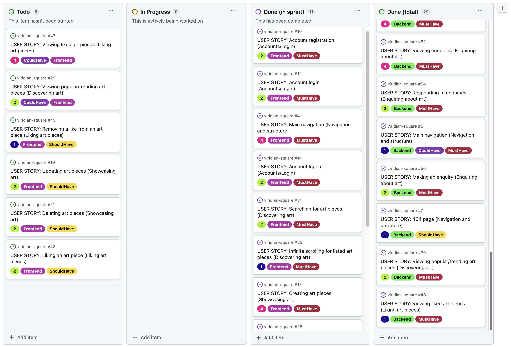

Points completed: 26
Velocity: 23.5

Notes/Reflections:
- During this sprint, I focused on making progress on functionality, rather than producing "finished" features. Due to time constraints and inexperience with React, I wanted to ensure I could get the expected results in terms of functionality and interaction between the frontend and backend. As a result, several of the containers and components created so far are functional but lack a good HTML structure, styles, and user feedback for interactions.

Actions taken:
- 6 PBI's moved back to the backlog
- New User Stories and other PBI's in the backlog:
    - Added several new user stories to address the current lack of structure, semantic HTML, user feedback, and styles across existing containers and components.
    - Added a PBI to prepare and test deployment
    - Added a PBI to adjust the ArtpieceSerializer, to more easily identify in the frontend whether an artpiece has been liked by the current user.
- Repriotised backlog in preparation for sprint 5

#### Sprint 5

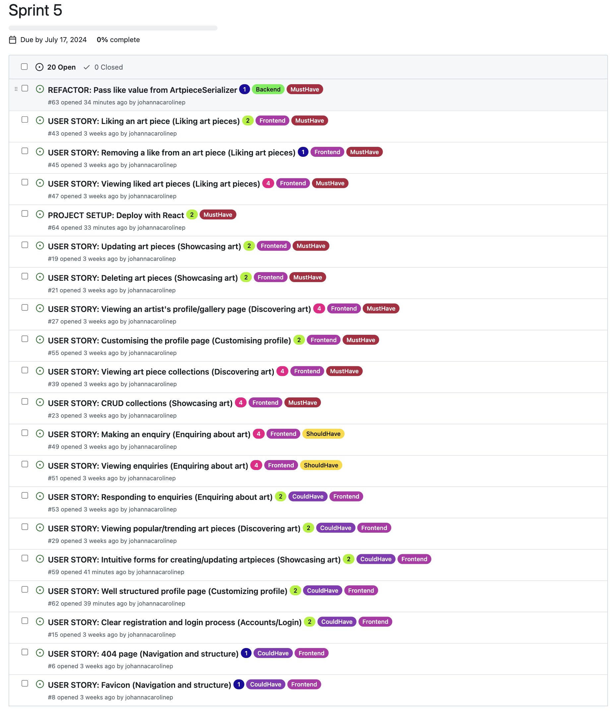

##### Sprint 5 wrap-up:

Project board at end of sprint 5:

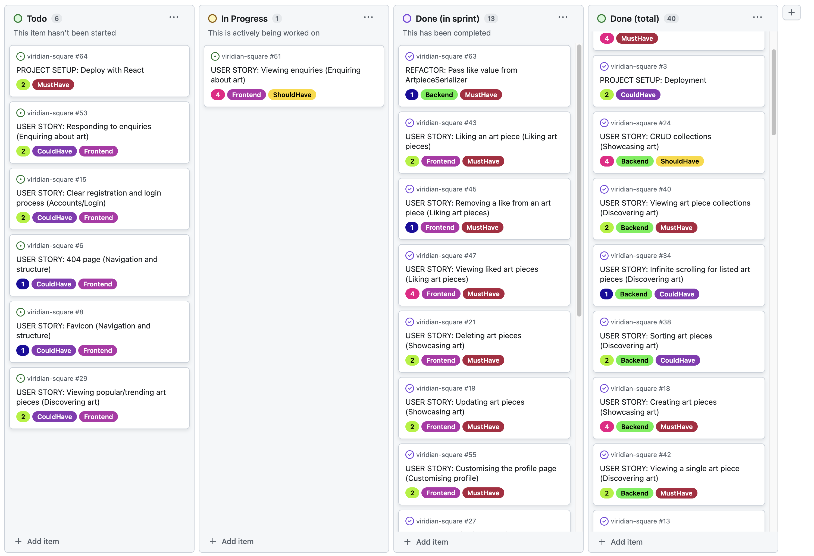

**Points completed:** 34

**Velocity:** 25.6 

Actions taken:
- 7 PBI's moved back to the backlog
    - This included 1 PBI with *Must Have* status: `PROJECT SETUP`: Deploy with React. Unfortunately, due to a widespread issue with *Code Institute*'s live database cluster this week, I was not able to action this PBI (see screenshot below from *Code Institute's* Slack Community *Announcements* channel).
    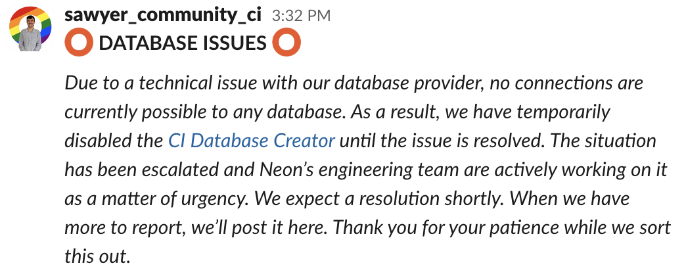
- Added new PBI's relating to documentation to the backlog.
- Reprioritised backlog.

#### Sprint 6:

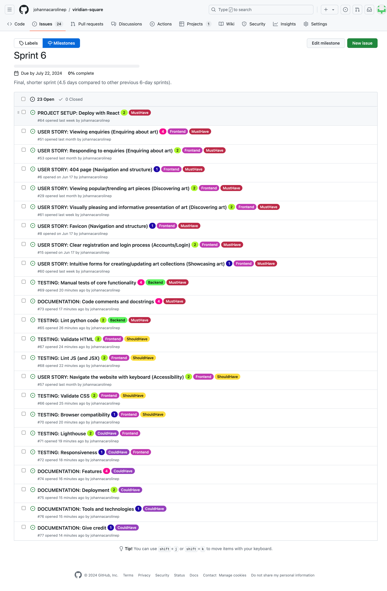


<a id="user-stories"></a>
### User stories:

**Epics**

1. Navigation and structure
2. Accounts/Login
3. Showcasing art
4. Discovering art
5. Liking art pieces
6. Enquiring about art
7. Customising profile
8. Accessibility


#### Navigation and structure
- `Main navigation:`  As a __Site User__, I can __always see the main navigation options on the top of the page,__ so that I can __easily and intuitively find my way around the website__.
- `404 page:` As a __Site User__ I can __see an informative 404 page guiding me back to the main page if I visit a page that does not exist by mistake__ so that I can __easily get back to the home page with minimal disruption.__
- `Favicon:` As a __Site User__ I can __see the website's favicon__ so that I can __easily find the website if I have multiple tabs open__.

#### Accounts/Login
- `Account registration:` As a __Site User__, I can __register an account with a username and password__ so that I can __like art pieces, make enquiries, and set up a gallery.__
- `Account login:`  As a __registered Site User__, I can __log in__ so that I can __fully engage with the platform, by e.g. posting art or making enquiries__.
- `Account logout:` As a __Logged-in User__, I can __log out__ so that I can __feel safe in that others cannot access my credentials.__
- `Clear registration and login process:` As a __Site User__, I can see __clear instructions, and get feedback and/or confirmation__ when using the forms to register/login/log out, so that I can __sign up/log in without unnecessary problems and enjoy the experience.__

#### Showcasing art
- `Creating art pieces`: As a **logged-in user**, I can **create an art piece, including an image and details (e.g., title)**, so that I can **showcase my art.**
- `Updating art pieces`: As a **logged-in user**, I can **update my own art piece**, so that I can **manage my own content**.
- `Deleting art pieces`: As a **logged-in user**, I can **delete my own art piece**, so that I can **manage and be in control of my own content.**
- `CRUD collections`: As a **logged-in user**, I can **create, update and delete collections**, so that I can **group related art pieces and present my art in a way that makes sense to me.**
- `Adding hashtags to art pieces`: As a **logged-in user**, I can **add hashtags to my own art piece**, so that I can **increase the searchability of my art**.
- `Intuitive forms for creating/updating artpieces`: As a **logged-in user who is creating/updating an artpiece**, I can **easily use and understand the form**, so that **the process does not feel like a burden**. 
- `Intuitive forms for creating/updating art collections`: As a **logged-in user who is creating/updating an art collection**, I can **easily use and understand the form**, so that **the process does not feel like a burden**. 

#### Discovering art
- `Viewing an artist's profile/gallery page`: As a **Site User**, I can **visit an artist's profile page/gallery page**, so that I can **view all art pieces and collections published by the artist in one place.**
- `Viewing popular/trending art pieces`:  As a **Site User**, I can **see popular/trending art pieces in a dedicated section on the discovery page** so that **I can get inspired to engage further and discover new great pieces.**
- `Searching for art pieces`: As a **Site User**, I can **search based on artist, title, collection title, and tags**, so that I can **find art pieces matching my criteria.**
- `Infinite scrolling for listed art pieces`: As a **Site User viewing a large number of art pieces in a list, the list is shown using infinite scroll**, so that **I do not need to navigate to separate pages**.
- `Filtering art pieces`: As a **Site User**, I can **filter the art pieces in a list view** so that I can **more easily find the pieces I am looking for and narrow down the results.**
- `Sorting art pieces`: As a **Site User**, I can **sort the art pieces in a list view (search results)** so that I can **more easily find the pieces I am looking for.**
- `Viewing art piece collection`: As a **Site User viewing an individual art piece**, I can **see if the art piece belongs to a collection** so that I can **easily find art pieces similar to the one I am viewing.**
- `Viewing a single art piece`: As a **Site User**, I can **click on an art piece in a list** so that I can **see a detailed view of the art piece.**
- `Visually pleasing and informative presentation of art`: As a **Site User**, I can **view art pieces, collections, and related information presented in a structured and logical way**, so that I can **consume the information and enjoy the art with as little effort as possible**.

#### Liking art pieces
- `Liking an art piece`: As a **logged-in site user**, I can **like an art piece**, so that I can **show appreciation to the artist and so that I can more easily find my way back to art pieces I enjoy.**
- `Removing a like from an art piece`: As a **logged-in site user who has liked an art piece**, I can **remove my like**, so that I can **change my mind or correct my mistake.**
- `Viewing liked art pieces`:  As a **logged-in site user**, I can **visit the “Liked” page**, so that I can **view all art pieces that I have liked.**

#### Enquiring about art
- `Making an enquiry`: As a **logged-in site user viewing an art piece which has been marked as for sale by the artist**, I can **make an enquiry**, so that I can **express my wish to connect with the artist.**
- `Viewing enquiries`: As a **logged-in site user who has made/received an enquiry**, I can **view the enquiry and its status on the enquiries page**, so that I can **keep track of my enquiries.**
- `Responding to enquiries`: As a **logged-in site user who has received an enquiry from a potential buyer**, I can **respond to the enquiry on the enquiries page**, so that I can **decide if my contact details will be shared with the potential buyer.**

#### Customising profile
- `Customising the profile page:` As a **logged-in user**, I can **customise my profile page/gallery page**, so that I can **better present who I am as an artist/art buyer.**
- `Well structured profile page:` As a **Site User visiting an artist's profile**, I can **view well structured and clearly defined sub-parts of the page** so that I can **easily consume and sort through the content**.

#### Accessibility
- `Navigate the website with keyboard`: As a **Site User not able to utilise a mouse** I can **focus on and access all interactive elements on the website using a keyboard** so that I can **be included, navigate on the website, access the content, and use all core functionality**.

<a id="future-improvements"></a>
## Future improvements

Below I have made a (non-exhaustive) list of possible future improvements for the platform.

Some are UX improvements while others are more to do with best practice and refactoring.

<details>
<summary>See list of future improvements</summary>

- Separation of concerns in artpieces/serializers.py: Refactor *serializers.py* in the artpieces app. When adding an artpiece, the user can create hashtags along with them, improving the "searchability" of the artpiece. In the ArtpiecSerializer, methods relating to validating the hashtags are included. Ideally, these methods should be in the separate HashtagSerializer. This would provide better modularity and separation of concerns.

- Components vs containers: The second refactoring improvement would be to refactor the presentational and container components inside the React app. Reading multiple sources online [geeksforgeeks](https://www.geeksforgeeks.org/reactjs-container-and-presentational-pattern-in-components/) and [react.dev](https://react.dev/reference/rules/components-and-hooks-must-be-pure) there appears to be a concensus that if a component decides **how** data will be presented then it should be a presentational component otherwise if it decides on **what** data will be displayed then it would be a container component. In many of my components the separation of these concerns may not be as distinct, this being due to my inexperience in React and its vast documentation of best practices.

- Email verification and password reset: For this application I had managed to enable a custom user model, overriding the default Django username by requiring email to sign up instead. A great future improvement would be to set up an email client that could handle email verification, lost password and password reset verifications. This would truly enhance UX as currently if the user were to forget their password they would be required to get in contact with an admin who would have to manually reset the password from the backend.

- Better backend logic for image management: I would like to spend time researching the multitude of options offered by Cloudinary for image storage and transformation. Given that the app is largely based around image assets, it would make sense to optimize the handling of images going forward.

- Nicer "viewing options" for artpieces: Tying back to image assets being a focal point in the app, an interesting future feature to plan out and implement would be better "viewing options" of artpieces. A simple example could be to allow users to view artpieces on different background colours.

- Messaging: The enquiries functionality would be a great place for improving the communication between artists and buyers. One effective future improvement would be to replace the announcement board style communication currently present with a fully functioning messaging window. This would be to allow back and forth discussion between the artist and buyer and enable an overall better user experience.

</details>

<a id="tools-and-technologies"></a>
## Tools and technologies

### Languages:
- [Python 3.12.4](https://www.python.org/downloads/release/python-385/) - Used to write the application's server-side logic.
- [Node 3.12.4](https://nodejs.org/en/download/package-manager) - Used to write the application's client-side logic.
- [JavaScript](https://www.javascript.com/) - Was used to develop interactive components on the website.
- [HTML5](https://developer.mozilla.org/en-US/docs/Web/HTML) - Was used for the structure of the web pages.
- [CSS](https://developer.mozilla.org/en-US/docs/Web/css) - Was used to style the website.

### Frameworks:
- [Django 4.2.10](https://www.djangoproject.com/) - Python-based framework used to build the web application.
- [Django Rest Framework 3.15.2](https://www.django-rest-framework.org/) - Python-based framework used to built the API.
- [dj-rest-auth](https://dj-rest-auth.readthedocs.io/en/latest/) - Used for authentication in the API.
- [React 18.13.1](https://18.react.dev/) - JavaScript library used to build the user interface.
- [React-Bootstrap 2.10.4](https://getbootstrap.com/) - CSS/JS framework used to style the website with Bootstrap components.
- [Create React App](https://create-react-app.dev/) - Used to set up the React application.

### Databases:
- [PostgreSQL from Code Institute](https://dbs.ci-dbs.net/) - The database used to store the website's model data.
- SQLite3(https://docs.python.org/3/library/sqlite3.html) - Used as database throughout development and testing

### Authentication
-   [dj-rest-auth](https://dj-rest-auth.readthedocs.io/en/latest/) - Used for authentication in the API.
-   [PyJWT](https://pyjwt.readthedocs.io/en/stable/) - Used for JSON Web Token handling in Django.

### Cloud:
- [Cloudinary](https://cloudinary.com/) - Was used for cloud-based image storage and management.
- [Heroku.com](https://id.heroku.com/login) - Was used to deploy the project.
- [GitHub](https://github.com/) - Was used to host the code of the website.

### Testing and validation
- [CI Python Linter](https://pep8ci.herokuapp.com/) - Was used to ensure the code adheres to PEP 8 standards
- [ESLint](https://eslint.org/) - Used to ensure code adheres to Javascript coding standards and best practices.
-   [Jest](https://jestjs.io/) - Used for testing React components.
-   [Postman](https://www.postman.com/) - Used for testing API requests.
-   [Python Unittests (through Django's APITestCase class)](https://docs.python.org/3/library/unittest.html) - Used for testing API views.
- [Chrome DevTools] (https://developer.chrome.com/docs/devtools/open/) - Was used for debugging
- [LightHouse](https://chromewebstore.google.com/detail/lighthouse/blipmdconlkpinefehnmjammfjpmpbjk?hl=sv&pli=1) - Was used to test and optimize website performance, best practices and accessibility
- [JSHint](https://jshint.com/) - Was used to lint JavaScript code.
- [W3C Markup Validation Service](https://validator.w3.org/) - Was used to validate HTML.
- [W3C CSS Validation Service](https://jigsaw.w3.org/css-validator/) - Was used to validate CSS.
- [Responsive Viewer](https://chromewebstore.google.com/detail/responsive-viewer/inmopeiepgfljkpkidclfgbgbmfcennb) - Was used to review the responsiveness of the website.

### Design
- [FontAwesome](https://fontawesome.com/) - Was used to create icons for the website.
- [Favicon generator](https://favicon.io/favicon-generator/) - Was used to create the website's favicon.
- [Adobe Illustrator](https://www.adobe.com/se/products/illustrator) - Was used to create the website logo and custom graphics.
- [Colormind](http://colormind.io/) - Was used to generate the colour scheme for the website.
- [Figma](https://www.figma.com/) - Was used to create a design wireframe.
- [Balsamiq](https://balsamiq.com/) - Was used to create schematic wireframes
- [Draw.io](https://app.diagrams.net/) - was used to create the ERD

### Other: 
- [gunicorn](https://gunicorn.org/) - Was used as the webserver to run the website.
- [psycopg2](https://www.psycopg.org/) - Was used as the database adapter.
- [VSCode](https://code.visualstudio.com/) - Was used as the IDE.
- [Git](https://git-scm.com/) - Was used for version control.
- [venv](https://docs.python.org/3/library/venv.html) - Used to manage the Python virtual environment.

<a id="repo-description"></a>
## Repository description

### Backend

<details>
<summary>Click for outline of repository structure and files</summary>

This is not an exhaustive list of all folders and files in the project, but is meant as a helping guide to understand how the project back-end is structured.

The repository and the django project are both named viridian-square. In the project folder the following can be found:

- settings.py: contains project level configuration settings and parameters.
- urls.py: project level url configuration

In the repo I have created seven apps, called *art_collections*, *art_pieces*, *enquiries*, *likes*, *profiles*, *users*, and the main app *viridian_api*. This was due to the design choice of wanting to have separation of concerns. Each app focuses on a specific aspect of the project, making the codebase easier to manage and maintain. By isolating different functionalities into separate apps, I can ensure modularity and promote reusability across different parts of the application.

Each app contains the following folders/files:
1. __migrations:__ This folder contains all the migrations done to the models inside of the app. These files are added in automatically when the command `python manage.py makemigrations` is executed. The folders contain SQL commands for the PostgreSQL database to be able to convert edits to the models into rows and tables.
2. __models.py:__ This file contains models for the app. These files is responsible for holding one model each.
3. __tests.py:__ The tests files hold all the tests for the methods found in the model.py and views.py file. These tests are run through the Django unittest package.
4. __views.py:__ This file contains the files used for serving the API endpoints.
5. __admin.py:__ Used to register models in the Django admin panel, and to customise how they appear in the admin panel.
6. __urls.py:__ App-level url configuration. Defines specific URL patterns for the specific app.
7. __serializers.py:__ Contains serializer classes, these are used to convert complex data types such as querysets and model instances into native Python data types that can then be easily rendered into JSON, XML, or other content types. Serializers are also used for deserialization, allowing parsed data to be converted back into complex types, and are crucial for creating APIs with Django REST Framework.
8. __apps.py:__ The AppConfig class defined in this file includes metadata for the app, such as its name and the label Django uses to refer to it. This file is essential for Django to recognize and include the app in the project.
   
The following are found in the root directory:
    
9. __staticfiles:__ The staticfiles folder is where the static files are collected from the static folder and are then able to be served in the live server. Before deployment of changes the command `python manage.py collectstatic` needs to have been run so any changes to the static folder are correctly added in the staticfiles folder.

10. __Procfile__  This file is needed by Heroku to be able to know where the root folder of the project is and to successfully build the project for live deployment.


</details>

### Frontend

<details>
<summary>Click for outline of repository structure and files</summary>

This is not an exhaustive list of all folders and files in the project, but is meant as a helping guide to understand how the project front-end is structured.

The react app is hosted in the frontend folder in the root folder of the repository.

The src folder contains the following folders and files:
1. __api:__ Contains code for communicating with the backend API, including functions to fetch and update data.
2. __assets:__ Holds a folder for images.
3. __components:__ Folder where the reusable UI components that are used throughout the application, such as buttons, modals, and layout components. The folder also stores the tests into those components denoted as ComponentName.test.jsx
4. __containers:__ Higher-level components that manage state and contain other components. These often correspond to pages of the app.
5. __contexts:__A folder for storing custom context definitions and providers for managing global state. The custom context CurrentUserContext.jsx is placed here. 
6. __hooks:__ Folder for storing custom hooks that encapsulate reusable logic. The useClickOutsideToggle.jsx defining a custom hook is stored in this folder.
7. __utils:__ A folder for storing utility functions and helpers used throughout the app.
8. __App.jsx:__ The root component of the React application, setting up routing and providing global context providers.
9. __setupTests.js:__ Configuration file for setting up testing utilities and environments for jest tests.

The following are found in the root frontend directory:
    
10. __.babelrc:__ Configuration file for Babel, used to transpile JavaScript code.
11. __jest.config.js:__ Configuration file for Jest, used for running tests.
12. __package.json:__ Contains metadata about the project and dependencies needed to run the app.
13. __node_modules:__ Directory where npm packages are installed.
14. __public:__ Directory for static files that can be directly served by the web server.
15. __Procfile__ 

</details>

<a id="deployment"></a>
## Deployment

The frontend and backend were deployed to [Heroku](https://id.heroku.com/login) as a unified project and can be accessed by this [link](https://viridian-api-492ce518a5c7.herokuapp.com/).

### To run the application locally:

*Note:*
1. This project requires you to have Python 3 installed on your computer.

2. In order to run the project you will need to install and run [virtualenv](https://packaging.python.org/en/latest/guides/installing-using-pip-and-virtual-environments/). This is due to compatibility issues between some versions of Python, such as 3.12.4 and the version of Python run on Heroku.

Create a local copy of the GitHub repository by following one of the two processes below:

- Download ZIP file:
  1. Go to the [GitHub Repository](https://github.com/johannacarolinep/viridian-square).
  2. Download the ZIP file containing the project.
  3. Extract the ZIP file to a location on your computer.

- Clone the repository:
  1. Run the following command in a terminal
  - `git clone git@github.com:johannacarolinep/viridian-square.git`

#### Create a SECRET_KEY
You will need to create a SECRET_KEY since Django requires this for cryptographic signing.

<details>
<summary>Click to open the instructions.</summary>
1. In the top-level directory of your project, create an *env.py* file.
2. Add *env.py* to *.gitignore*.
3. In *env.py* add *import os* at the top of the file.
4. Still in *env.py*, add the following line of code:
```python
os.environ.setdefault(
    "SECRET_KEY", "<your secret key>"
)
```
5. You can use an online key generator for your secret key value, such as [RandomKeygen](https://randomkeygen.com/)

</details>

#### Create and connect a PostgreSQL database to the project
To run the project, you will need to create and connect a PostgreSQL database instance. I used the [tool provided by Code Institute](https://dbs.ci-dbs.net/) for this, which is available to current Code Institute students.

<details>
<summary>Click to open the instructions</summary>

1. Go to [https://dbs.ci-dbs.net/](https://dbs.ci-dbs.net/).
2. Follow the on-screen instructions to create a database.
3. You should now have received an email containing the URL for your database.
4. In the *env.py* file of your project, add the following line of code:
```python
os.environ.setdefault(
    "DATABASE_URL", "<the URL for your database>"
)
```

Alternatively, the project can be run locally with the SQLite3 database. To do this, in *env.py* add:

```python
os.environ['DEV'] = '1'
```

</details>

#### Connect a Cloudinary account to the project
[Cloudinary](https://cloudinary.com/), a cloud media platform, is used to store and serve images in the project.

<details>
<summary>Click to open the instructions</summary>

1. If you do not already have a Cloudinary account, you can create a free account [here](https://cloudinary.com/users/register_free).
2. Sign in to your Cloudinary account.
3. Once logged in, go to the tab "Programmable media", in the menu on the left-hand side, and then click "Dashboard". You should now see your "Product Environment Credentials".

4. In the *env.py* file of your project, add the following lines of code (with the correct values):

```python
os.environ.setdefault(
    "CLOUDINARY_URL", "<paste in value from the Cloudinary Dashboard>"
)
os.environ.setdefault("CLOUD_NAME", "<paste in value from the Cloudinary Dashboard>")
```

</details>

#### Add ALLOWED_HOST and CLIENT_ORIGIN in env.py

In *env.py* add:
```python
os.environ['ALLOWED_HOST'] = 'localhost'
os.environ['CLIENT_ORIGIN'] = 'http://localhost:3000/'
```

<br>

Install the dependencies listed in *requirements.txt*. 

  - While in the project directory, run the following command in the terminal:

```
pip install -r requirements.txt
```

#### Run migrations
After completing the preceding steps, you should be able to migrate the models of the project to your database. 

In the terminal, run the following command:
```
python3 manage.py makemigrations
```

Followed by:
```
python3 manage.py migrate
```

#### Run the project locally
You should now be able to run the backend locally by running the following command in the terminal:
```
python3 manage.py runserver
```

#### Run the frontend locally
Open a different terminal and ensure you have a stable version of node such as v18.20.4
Run the following command to enter into the frontend folder.
```
cd frontend
```
Then to install the packages you will need to run.
```
npm install
```
After the packages have finished installing you can run the React server with
```
npm start
```
Go to http://localhost:3000 to access the page.


### Run the project as a remote web application by deploying to Heroku:

<details>
<summary>Click to open the instructions</summary>

1. Clone the repository:
	 - Create your own GitHub repository to host the code. You will need to host this code on your repository for the following to work.
	- Run the command `git remote set-url origin <Your GitHub Repo Path>` to set the remote repository location to your repository.

 1. Ensure that the `DEBUG` constant is set to `False` in the *settings.py* file of the project.

 1. Before pushing the files to your repository, you need to correctly collect the static files of the repository to he `staticfiles` folder. In the terminal, run the command `python3 manage.py collectstatic`.

1. Create the build folder required by Node to work on the live server. For first deployment use `npm run build && mv build ../staticfiles/.`. For subsequent deployments, use `npm run build && rm -rf ../staticfiles/build && mv build ../staticfiles/.`.

  5. Push the files to your repository with the following command:
  `git push`
  
  6. Create a Heroku account if you don't already have one here [Heroku](https://dashboard.heroku.com).

  7. Create a new Heroku application on the [Heroku Apps page](https://dashboard.heroku.com/apps), by clicking "New" in the upper right corner, and selecting "Create new app":

    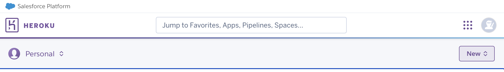

  8. Name the app, choose a region, and click "Create app".
    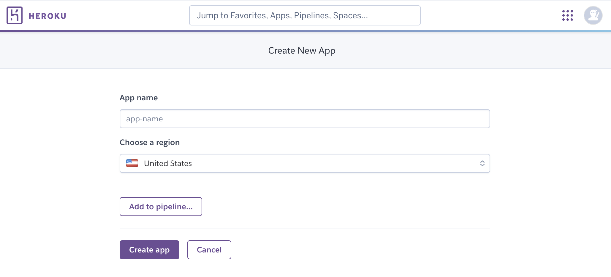

  9. Go to the Deploy tab:
    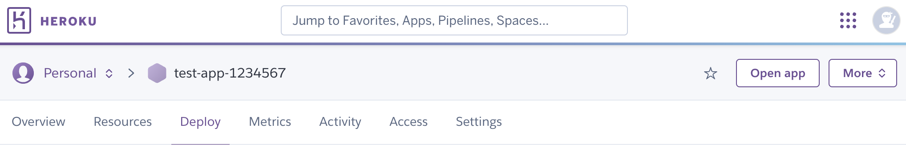

  10. In the "Deployment method" section, click on "GitHub - Connect to GitHub". Search for your repository and connect your application.
    

  11. Next, go to the Settings tab:
  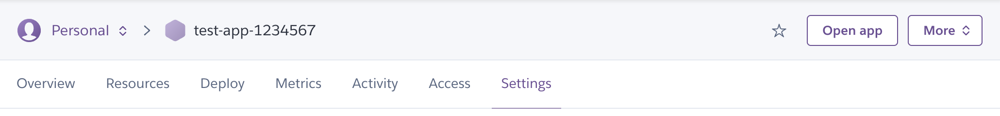

  12. Next, in the "Config Vars" section, click "Reveal Config Vars". You will need to add 6 Config Vars
  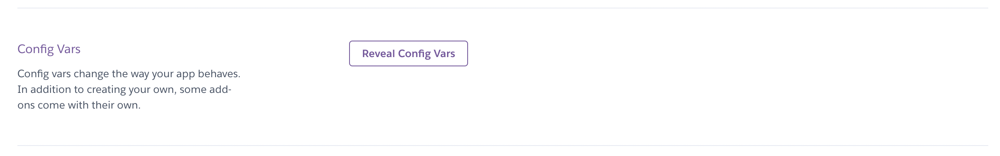

- Config Var number 1:
    - **Key:** CLOUD_NAME **Value:** Copy the value of the CLOUD_NAME constant in your *env.py* file and paste it here (the value can also be found in your Cloudinary account).

- Config Var number 2:
    - **Key:** CLOUDINARY_URL **Value:** Copy the value of the CLOUDINARY_URL constant in your *env.py* file and paste it here (Alternatively the value can be found by logging in to your Cloudinary account).

- Config Var number 3:
    - **Key:** DATABASE_URL **Value:** Copy the value of the DATABASE_URL constant in your *env.py* file and paste it here. 

- Config Var number 4:
    - **Key:** SECRET_KEY **Value:** You can use an online secret key generator to create a value for this config var. It's good practice not to use the same value as the SECRET_KEY constant in your *env.py* file.

- Config Var number 5:
	- **Key:** ALLOWED HOST **Value:** The URL of the deployed project, without "https://" and without the trailing "/" (e.g. viridian-api-492ce518a5c7.herokuapp.com)

- Config Var number 6:
	- **Key:** CLIENT ORIGIN **Value:** The full URL of your deployed app (e.g. https://viridian-api-492ce518a5c7.herokuapp.com/)

    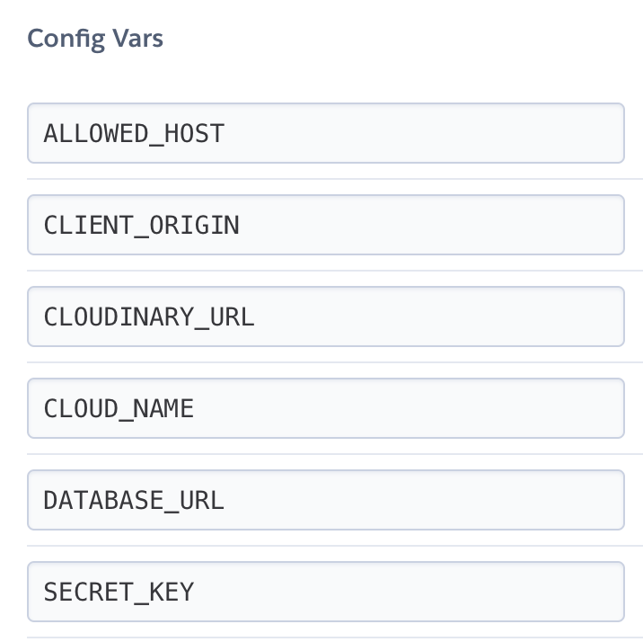

  13. After adding the 6 Config Vars, go back to the Deploy tab:

      

  14. In the "Manual deploy" section, click "Deploy Branch":

      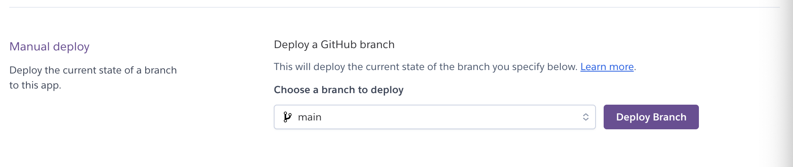

      - Wait for the completion of the deployment.

      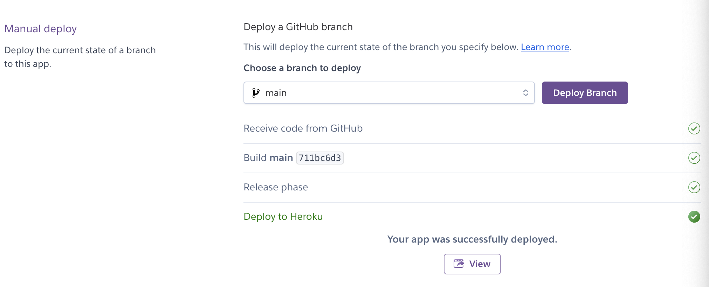

  15. You can now click the "View" button (in the screenshot above), to launch the application.

</details>


<a id="testing"></a>
## Testing
All documentation related to testing of the project can be found in [TESTING.md](./TESTING.md).

<a id="bugs"></a>
## Bugs

#### 2024-07-20: Incorrect use of React Form.Group

<details>
<summary>Click to see bug details</summary>

**Issue:** I noticed while checking my code that I received a warning that a form input field did not have a label. This related to the HTML best practice where form input fields with attribute `id` should have a label with attribute `for`.

I then made sure that all my form inputs had labels associated with them and that the label `for` (`htmlFor`) matched the input `id` attributes. 

Yet when I ran my app locally I noticed that I had gotten even more errors.

**Steps taken:**

- Due to this breaking intended behavior, I checked the React Bootstrap documentation.
- The solution implemented was that the React Bootstrap <Form.Group/> component that wraps the input and form elements itself injects the necessary id and for attributes and displays the html as required at render time. So explicit id and htmlfor attributes are not neccessary.

Instead the <Form.Group/> component should have a `controlID` attribute. 

**Solution:**

- Basing my new solution largely on this post from the [React From.Control page](https://react-bootstrap.netlify.app/docs/forms/form-control) I reviewed all <Form.Group/> instances and ensured they all used `controlId`, e.g. :

```
    <Form.Group controlId="hashtags">
        <Form.Label>Hashtags</Form.Label>
        <Form.Control
            type="text"
            name="hashtags"
            value={hashtags}
        />
    </Form.Group>
```

In the above example, the use of ` <Form.Label htmlFor="formHashtags">Hashtags</Form.Label>` previously has been replaced by `<Form.Label>Hashtags</Form.Label>`. The id attribute in the <Form.Control> was also removed.

Finally, I redeployed the website and tried clicking on pages containing forms to check that the behaviour and functionality were working correctly.

</details>

### BUG: 2024-07-18: Custom serializers 'REGISTER_SERIALIZER' and 'USER_DETAILS_SERIALIZER' not used by dj-rest-auth register and login views.

<details>
<summary>Click to see bug details</summary>

**Background:**

I had previously noticed that the code was not using my custom `USER_DETAILS_SERIALIZER` for the `dj-rest-auth` LoginView. When working on the user login in the frontend, I worked around this by first posting to `dj-rest-auth/login/` to sign the user in, then make a GET request to `dj-rest-auth/user/` and set the `currentUser` with the response from this endpoint (for which I had managed to use the custom serializer by writing a custom view):

```python
const handleSubmit = async (event) => {
    event.preventDefault();
    try {
      const { data } = await axios.post("/dj-rest-auth/login/", signInData);
      setTokenTimestamo(data);
    } catch (err) {
      setErrors(err.response?.data);
    }

    try {
      const { data } = await axios.get("/dj-rest-auth/user/");
      setCurrentUser(data);
      navigate("/");
    } catch (err) {
      setErrors(err.response?.data);
    }
  };

```

**Issue:**

Testing user registration in the frontend and receiving a 500 error instead of a custom 400 error I had set in the `REGISTER_SERIALIZER` later made me realize that my custom serializer for registration was not in use either, and made me revisit the issue.

**Steps taken:**

After searching online forums I came across [this post](https://stackoverflow.com/questions/62291394/django-rest-auth-dj-rest-auth-custom-user-registration) on Stackoverflow, leading to the dj-rest-auth documents [here](https://dj-rest-auth.readthedocs.io/en/latest/configuration.html).

The bug was due to referencing the custom serializers in the old, deprecated, way instead of registering them in the `REST_AUTH` object in settings.py.

**Solution:**

I registered both custom serializers in the `REST_AUTH` object:
```python
REST_AUTH = {
    'USE_JWT': True,
    'JWT_AUTH_HTTPONLY': False,
    'JWT_AUTH_SECURE': True,
    'JWT_AUTH_COOKIE': 'viridian-auth',
    'JWT_AUTH_REFRESH_COOKIE': 'viridian-refresh-token',
    'JWT_AUTH_SAMESITE': 'None',
    'REGISTER_SERIALIZER': 'users.serializers.CustomRegisterSerializer',
    'USER_DETAILS_SERIALIZER': 'users.serializers.CurrentUserSerializer',
}
```

I then confirmed that I now receive the correct 400 errors, caught by validation methods in the serializer, instead of the 500 error previously mentioned.

After confirming this, I went on to update how I handle sign in as well, given that I was now able to use the custom `USER_DETAILS_SERIALIZER` for the login endpoint:
```python
const handleSubmit = async (event) => {
    event.preventDefault();
    try {
      const { data } = await axios.post("/dj-rest-auth/login/", signInData);
      setCurrentUser(data.user);
      setTokenTimestamp(data);
      navigate("/");
    } catch (err) {
      setErrors(err.response?.data);
    }
  };
``````

</details>


### BUG: 2024-07-07: Connection Refused error for POST request to live DB /dj-rest-auth/registration/.

<details>
<summary>Click to see bug details</summary>

**Issue:**

When making a POST request to the `/dj-rest-auth/registration/` endpoint on my live database, I encountered the following error:

```
ConnectionRefusedError: [Errno 61] Connection refused
[07/Jul/2024 14:15:14] "POST /dj-rest-auth/registration/ HTTP/1.1" 500 199724
```

This issue did not occur when using the local SQLite3 database.

**Steps taken:**

Researching the issue online, I found this [thread](https://github.com/pennersr/django-allauth/issues/1843), which suggested that Django was attempting to send a verification email, causing the connection refused error. This seemed plausible as I had customised the user model and made the email field mandatory.

**Solution:**
Following the advice from the thread, I added the following setting to `settings.py`:

```
ACCOUNT_EMAIL_VERIFICATION = "none"
```

This resolved the issue, and I was able to successfully register a user without encountering the error.

</details>


### BUG: 2024-07-01: Removing the `username` field from `CustomUser`.

<details>
<summary>Click to see bug details</summary>

**Background:** 

I wanted to remove the `username` field from my `CustomUser` model since I am using email for authentication and the `username` would not be used elsewhere in the app.

**Issue:**

After removing the `username` field and any references to it, I encountered the following error during migration:

```
django.core.exceptions.FieldDoesNotExist: CustomUser has no field named 'username'
```

**Steps taken:**

1. Initially, I reset the database by deleting the `SQLite3` file, removing migration files, creating new migrations, and migrating. This did not resolve the issue.
1. I identified that the errors were related to `dj_rest_auth` and `django-allauth` expecting a `username` field by default.
1. Based on online research, I added the following configuration to `settings.py` (source: [StackOverflow - *How to remove username field in the register form on django admin?*](https://stackoverflow.com/questions/36094342/how-to-remove-username-field-in-the-register-form-on-django-admin)):

```
ACCOUNT_AUTHENTICATION_METHOD = 'email'
ACCOUNT_USER_MODEL_USERNAME_FIELD = None
ACCOUNT_EMAIL_REQUIRED = True
ACCOUNT_USERNAME_REQUIRED = False
```

**Solution:**

1. Adding the above configuration informed `django-allauth` not to expect a `username` field.
1. After updating `settings.py`, I successfully ran migrations and confirmed the creation of `CustomUser` instances in the Django Admin panel.

</details>

<a id="credits"></a>
## Credits

- [Customising the user model - Django documentation](https://docs.djangoproject.com/en/5.0/topics/auth/customizing/#a-full-example)
- [Installation dj-rest-auth](https://dj-rest-auth.readthedocs.io/en/latest/installation.html)
- [m2m_changed signals - Django documentation](https://docs.djangoproject.com/en/5.0/ref/signals/#m2m-changed) - Used for removing orphaned hashtags
- [Stack Overflow - Efficiently delete orphaned m2m objects/tags in Django](https://stackoverflow.com/questions/10609699/efficiently-delete-orphaned-m2m-objects-tags-in-django)
- [Code Institute resource: Creating a new React app in an existing DRF workspace](https://code-institute-students.github.io/advfe-unified-workspace/creating-an-app-in-a-workspace/00-creating-an-app-in-a-workspace)

### Media

[Watercolour painting seagull](https://pixabay.com/illustrations/bird-sea-painting-art-ocean-storm-3342446/) - Pixabay
[Watercolour painting bridge](https://pixabay.com/illustrations/watercolour-painting-art-effect-4820075/)
- [Watercolour painting woman](https://pixabay.com/illustrations/woman-painting-watercolor-paper-4178302/)
[Watercolour river](https://pixabay.com/illustrations/watercolour-watercolor-painting-2498024/)

