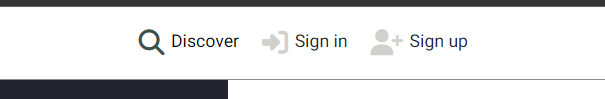
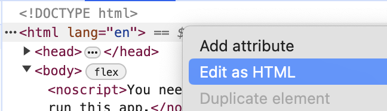

# Testing

**Table of content**
- [Browser compatibility testing](#browser-compatibility)
- [Responsiveness testing](#responsiveness)
- [Manual testing](#manual-testing)
    - [Manual testing of core functionality](#manual-test-functionality)
    - [Manual testing of user stories](#user-story-testing)
- [Automated tests](#automated-tests)
    - [Django unit tests](#unittests)
    - [Jest tests for JavaScript](#jest-tests)
- [Lighthouse tests](#lighthouse)
- [Validation of HTML](#html-validation)
- [Validation of CSS](#css-validation)
- [Linting of Python code](#python-lint)
- [Linting of JavaScript code](#js-lint)

<a id="browser-compatibility"></a>
## Browser compatibility testing

The website was tested for compatibility in Chrome, Safari, Microsoft Edge, and Firefox (see screenshots and details below). One issue was found during testing in Safari, and added as a bug.

<details>
<summary>Chrome</summary>

No issues found


</details>

<details>
<summary>Safari</summary>

*NOTE:* In Safari, there seems to be an issue with the sizing of cards/card images (please see screenshots). Since this was not detected until a very late stage (same day as project submission), I will not be able to prioritise investigating and fixing before project submission. Instead, this finding will be added as a known bug, to be addressed in the future. 


</details>

<details>
<summary>Microsoft Edge</summary>

No issues found


</details>

<details>
<summary>Firefox</summary>

No issues found


</details>

<a id="responsiveness"></a>
## Responsiveness testing

Responsiveness was tested with [Responsive Viewer](https://chromewebstore.google.com/detail/responsive-viewer/inmopeiepgfljkpkidclfgbgbmfcennb?hl=sv) (and throughout development with Google Dev Tools).

Please see screenshots from responsiveness testing in the PDF's linked below:

- [Mobile](documentation/responsiveness/responsiveness_mobile.pdf)
- [Tablet](documentation/responsiveness/responsiveness_tablet.pdf)
- [Desktop](documentation/responsiveness/responsiveness_desktop.pdf)

<a id="manual-testing"></a>
## Manual testing TBC

<a id="manual-test-functionality"></a>
### Manual testing of core functionality TBC

### Manual testing of user stories WIP


<details>
<summary>Navigation & structure</summary>

| __User story__ | __Acceptance criteria__ | __Pass?__ | __Screenshot (if relevant)__ | __Comments__ |
| ------------- | -----------| -------------------- | :-------: | ------------ |
| As a __Site User__, I can __always see the main navigation options on the top of the page__ so that I can __easily and intuitively find my way around the website__. | 1. Given a user is not logged in, at the top of the page, the user can see the options of “home”, “register”, “log in”, and “discover”. <br/>2. Given the user is logged in, the options showing are instead “home”, “log out”, “discover”, “liked”, and “enquiries”.<br/>3. These options are visible and reachable from all pages on the website.<br/>4. The options have a hover effect to provide instant feedback to the user when navigating the site. | Y | web view  <br/> Mobile view below|  |
| As a __Site User__ I can __see an informative 404 page guiding me back to the main page if I visit a page that does not exist by mistake__ so that I can __easily get back to the home page with minimal disruption.__ | 1. Given a user visits a page on the website that does not exist, they are served a custom 404 page.<br/>2. The 404 page contains a link back to the home page. | Y |  | - |
| As a  **Site User**  I can  **see the website's favicon**  so that I can  **easily find the website if I have multiple tabs open**. | 1. The site has a favicon, adhering to the website design and colour scheme | Y |  | - |


</details>

<details>
<summary>Accounts/Login</summary>

| __User story__ | __Acceptance criteria__ | __Pass?__ | __Screenshot (if relevant)__ | __Comments__ |
| ------------- | -----------| -------------------- | :-------: | ------------ |
| __Account registration:__ As a __Site User__, I can __register an account with a username and password__ so that I can __like art pieces, make enquiries, and set up a gallery.__ | 1. The frontend provides a registration form to the user.<br/>2.The form submits the registration details to the backend API. | Y |  | - |
| As a  **registered Site User**, I can  **log in**  so that I can  **fully engage with the platform, by e.g. posting art or making enquiries**. | 1. The frontend provides a login form to the user<br/>The form submits the login details to the backend API.<br/>3. The form displays feedback to the user if input is invalid<br/>4. Upon successful login, the UI is updated to reflect the logged in state of the user. | Y |  | - |
|  As a __Logged in User__, I can __log out__ so that I can __feel safe in that others cannot access my credentials.__ | 1. When the user clicks “Log out,” the frontend sends a logout request to the backend API, including the JWT.<br/>2. Upon successful logout, the frontend clears the stored JWT.<br/>3. Then, the UI is updated to reflect the logged out state of the user. | Y | N/A | Once the user clicks log out, they are logged out and redirected to the main page. |
| As a __Site User__, I can see __clear instructions, get feedback and/ confirmation__ when using the forms to register/log in/log out, so that I can __sign up/log in without unnecessary problems and enjoy the experience.__ | 1. The sign up page includes clear instructions<br/>2. The frontend displays feedback messages based on the response from the backend API, indicating whether signup was successful or if there were errors and/or updates the UI to reflect the change in login status. | Y |  | Errors are shown if login or signup is invalid |


</details>


<details>
<summary>Showcasing art</summary>

| __User story__ | __Acceptance criteria__ | __Pass?__ | __Screenshot (if relevant)__ | __Comments__ |
| ------------- | -----------| -------------------- | :-------: | ------------ |
| As a **logged in user**, I can **create an art piece, including an image and details (e.g., title)**, so that I can **showcase my art.** | 1. Given the user is logged in, they can access a form to create a new art piece.<br/>2. The form allows the user to upload an image, enter a title, and provide additional details.<br/>3. Upon successful submission, the art piece is displayed on the user's profile/gallery page.<br/>4. The user receives a confirmation message upon successful submission. | Y |  | No success message on successful creation, but instead redirect to the created artpiece's page |
| As a **logged in user**, I can **update my own art piece**, so that I can **manage my own content**. | 1. Given a logged in user, they can access an edit form for their own art piece.<br/>2. The form pre-fills with the current details of the art piece, including the image and title.<br/>3. Upon successful submission of the edit form, the updated art piece is displayed on the user's profile/gallery page. | Y |  | - |
| As a **logged in user**, I can **delete my own art piece**, so that I can **manage and be in control of my own content.** | 1. Given a logged in user, they can delete their own art piece by clicking a delete button.<br/>2. The user receives a confirmation message upon successful deletion. | Y |  | - |
| As a **logged in user**, I can **create, update and delete collections**, so that I can **group related art pieces and present my art in a way that makes sense to me.** | 1. Given a logged in user, they can access a form to create a new collection.<br/>2. The form allows the user to enter a title and description for the collection,.<br/>3. Upon successful submission, the collection is displayed on the user's profile with the title and description.<br/>4. Given a logged in user with a collection, they can access an edit form for the collection.<br/>5. The form pre-fills with the current details of the collection.<br/>6. Users can add or remove art pieces from the collection.<br/>7. Given a logged in user with a collection, they can delete the collection by clicking a delete button.<br/>8. The user receives confirmation messages upon successful creation, update, or deletion. | Y |  <br/>  | - |
| As a **logged in user**, I can **add hashtags to my own art piece**, so that I can **increase the searchability of my art**. | 1. Given a logged in user, while creating or editing an art piece, they can add hashtags through an input field.<br/>2. The input field allows multiple tags to be entered, separated by spaces.<br/>3. Given an art piece with hashtags, those hashtags are displayed with the art piece on the art piece detail page. | Y |  | - |
| As a **logged-in-user who is creating/updating an artpiece**, I can **easily use and understand the form**, so that **the process does not feel like a burden**. | **1:** The form provides user feedback<br/>**2.** The form elements are evenly spaced and aligned, helping the user visually navigate the form.<br/>**3.** For image upload, a preview image is shown.<br/>**4.** On successful creation/update, the user is redirected to the relevant artpiece. | Y | N/A | Details shown in screenshots above |
| As a **logged-in-user who is creating/updating an art collection**, I can **easily use and understand the form**, so that **the process does not feel like a burden**. | **1:** The form provides user feedback<br/>**2.** The form elements are evenly spaced and aligned, helping the user visually navigate the form<br/>**3.** After successful art collection creation, the user gets an option to bulk add artpieces to the collection.<br/>**4.** After successful creation/update, the user is redirected to the collection so that they can confirm the created form/changes are as expected. | Y | N/A | Functionality provided in above screenshots |

</details>


<details>
<summary>Discovering art</summary>

| __User story__ | __Acceptance criteria__ | __Pass?__ | __Screenshot (if relevant)__ | __Comments__ |
| ------------- | -----------| -------------------- | :-------: | ------------ |
| As a **Site User**, I can **visit an artist's profile page/gallery page**, so that I can **view all art pieces and collections published by the artist in one place.** | 1. When visiting a user's profile/gallery page, all of their art pieces are listed on the page.<br/>2. If the profile owner has any collections, these collections are also accessible from their profile/gallery page.<br/>3. Art pieces and collections are displayed in an organised and visually appealing manner. | Y |  <br/>  | - |
| As a **Site User**, I can **see popular/trending art pieces in a dedicated section on the discovery page** so that **I can get inspired to engage further and discover new great pieces.** | 1. When a user opens the discovery page, a section displaying popular/trending art pieces is shown. | Y |  | - |
| As a **Site User**, I can **search based on artist, title, collection title, and tags**, so that I can **find art pieces matching my criteria.** | 1. The discovery page contains a search bar where users can enter search criteria.<br/>2. When a user performs a search, a list of art pieces matching the user's criteria is displayed. | Y |  | - |
| As a **Site User viewing a large number of art pieces in a list, the list is shown using infinite scroll**, so that **I do not need to navigate to separate pages**. | 1. Given more than 8 results in the database matching the user's criteria, infinite scrolling is used to load more results as the user scrolls down.<br/>2. Additional art pieces are loaded seamlessly without refreshing the page. | Y | - | 8 art pieces are loaded first, then more results are loaded |
| As a **Site User**, I can **filter the art pieces in a list view** so that I can **more easily find the pieces I am looking for and narrow down the results.** | 1. When on a list view, the user can filter the list based on factors including "for sale" status and art medium used.<br/>2. Filter options are easily accessible and intuitive to use. | Y |  | - |
| As a **Site User**, I can **sort the art pieces in a list view (search results)** so that I can **more easily find the pieces I am looking for.** | 1. When on a list view (search results), the user can sort the list based on publication date and number of likes.<br/>2. Sort options are clearly visible and easy to select. | Y |  | - |
| As a **Site User viewing an individual art piece**, I can **see if the art piece belongs to a collection**, so that I can **easily find art pieces similar to the one I am viewing.** | 1. Given an art piece belongs to a collection, a link to the collection is shown on the art piece detail page.<br/>2. When the user clicks on the collection link, the user is shown the collection page on the artist's gallery page.<br/>3. The collections displays all art pieces that are associated with the collection. | Y |  | - |
| As a **Site User**, I can **click on an art piece in a list** so that I can **see a detailed view of the art piece.** | 1. When an art piece is clicked, the detailed view of the art piece is displayed.<br/>2. The detailed view includes the art piece image, title, artist name, description, tags, and any collection it belongs to.<br/>3. If the art piece is for sale, the detailed view also includes the option to make an enquiry. | Y | N/A | Screenshot above shows the same. |
| As a **Site User**, I can **view art pieces, collections, and related information presented in a structured and logical way**, so that I can **consume the information and enjoy the art with as little effort as possible**. | **1.** When displayed as a list, heights/padding/margin are used consistently, helping the user avoid confusion. <br/>**2.** Relevant information is displayed together with the image/images.<br/>**3.** Structure, space, colour, and other styles, are used, to help the user separate different pieces of information relating to the artpiece/collection. | Y | N/A | Screenshots provided above |


</details>


<details>
<summary>Liking artpieces</summary>

| __User story__ | __Acceptance criteria__ | __Pass?__ | __Screenshot (if relevant)__ | __Comments__ |
| ------------- | -----------| -------------------- | :-------: | ------------ |
| As a **logged-in site user**, I can **like an art piece**, so that I can **show appreciation to the artist and so that I can more easily find my way back to art pieces I enjoy.** | 1.  Each art piece has a visible "like" button/icon.<br/>2.  When the user clicks the "like" button/icon, the button/icon visually changes to indicate the art piece has been liked.<br/>3.  The total number of likes for the art piece is updated when clicking the button.<br/>4.  An error message is displayed if the like action fails.<br/>5.  I cannot like an art piece if I am not logged in. | Y |  | - |
| As a **logged-in site user who has liked an art piece**, I can **remove my like**, so that I can **change my mind or correct my mistake.** |1.  Given a logged in user who has liked an art piece, each liked art piece has a visible "unlike" button.<br/> 2.  When the user clicks the "unlike" button, the button visually changes to indicate the art piece is no longer liked.<br/>3.  The total number of likes for the art piece is updated.<br/>4.  An error message is displayed if the unlike action fails. | Y |  | - |
| As a **logged-in site user**, I can **visit the “Liked” page**, so that I can **view all art pieces that I have liked.** | 1. Given a logged in user, there is a "Liked" page accessible from the main navigation or user profile.<br/>2.  The "Liked" page displays all art pieces that the user has liked.<br/>3.  The user can click on any art piece to view its detailed view. | Y |  | - |

</details>


<details>
<summary>Enquiring about art</summary>

| __User story__ | __Acceptance criteria__ | __Pass?__ | __Screenshot (if relevant)__ | __Comments__ |
| ------------- | -----------| -------------------- | :-------: | ------------ |
| As a **logged-in site user viewing an art piece which has been marked as for sale by the artist**, I can **make an enquiry**, so that I can **express my wish to connect with the artist.** | 1. Given an art piece is marked as "for sale," a visible "Enquire" button is displayed on the art piece detail page.<br/>2. When the user clicks the button, a modal appears where the user can enter their message.<br/>3. The user can submit the enquiry by clicking a "Submit" button within the modal.<br/>4. A confirmation message is displayed upon successful submission.<br/>5. An error message is displayed if the enquiry submission fails. | Y |  | - |
| As a **logged-in site user who has made/received an enquiry**, I can **view the enquiry and its status on the enquiries page**, so that I can **keep track of my enquiries.** | 1.  Given a logged in user, a "My Enquiries" page is accessible from the main navigation.<br/>2.  The "My Enquiries" page displays a list of all enquiries made by/received by the user.<br/>3.  Each enquiry in the list shows the art piece title, artist name, and enquiry status (e.g., pending, accepted, declined).<br/>4. The user can click on an enquiry to view the enquiry details. | Y |  | - |
| As a **logged-in site user who has received an enquiry from a potential buyer**, I can **respond to the enquiry on the enquiries page**, so that I can **decide if my contact details will be shared with the potential buyer.** | 1. Given a logged in user, a "My Enquiries" page is accessible from the main navigation.<br/>2. On the “My Enquiries” page, the user can click on an enquiry to see its details and respond to it.<br/>3. When the user clicks a response option, the enquiry status changes and a confirmation message is shown. | Y |   | - |

</details>

<details>
<summary>Customising profile</summary>

| __User story__ | __Acceptance criteria__ | __Pass?__ | __Screenshot (if relevant)__ | __Comments__ |
| ------------- | -----------| -------------------- | :-------: | ------------ |
| As a **logged-in user**, I can **customise my profile page/gallery page**, so that I can **better present who I am as an artist/art buyer.** | 1.  Given a logged-in user, they can access a form to customise their profile/gallery page via a "Edit profile" button on the profile page.<br/>2.  Customisations include profile image, description and location.<br/>3.  Upon successful submission, the user receives a confirmation message and the profile page reflects the updated information.<br/>4.  If the update fails, the user receives appropriate error messages. | Y |  | - |
| As a **Site User visiting an artist's profile**, I can **view well structured and clearly defined sub-parts of the page** so that I can **easily consume and sort through the content**. | 1. The profile page is split into separate sections, with content visually separated on the page. <br/>2. The profile page contains clear in-page navigation options for the user to navigate betwen the profile's artpieces and collections. | Y | N/A | screenshots provided above |


</details>


<details>
<summary>Accessibility</summary>

| __User story__ | __Acceptance criteria__ | __Pass?__ | __Screenshot (if relevant)__ | __Comments__ |
| ------------- | -----------| -------------------- | :-------: | ------------ |
| As a **Site User not able to utilise a mouse** I can **focus on and access all interactive elements on the website using a keyboard** so that I can **be included, navigate on the website, access the content, and use all core functionality**. |1. All interactive elements, such as buttons, form fields, and navigation, are accessible using a keyboard alone, without relying on mouse interactions. | Y | N/A | Tested signing up, signing in, creating artpiece and collection, editing a collection (adding artpieces), using main navigation, making an enquiry, reading an enquiry |

</details>

<a id="automated-tests"></a>
## Automated tests

<a id="unittests"></a>
### Django unit tests

<details> 
<summary>Click for details relating to Django rest unit tests</summary>

</details>

<a id="jest-tests"></a>
### Jest tests

<details>
<summary>Click for details relating to Jest tests</summary>

</details>

<a id="lighthouse"></a>
## Lighthouse tests

<details>
<summary>Click to see screenshots of test results on mobile</summary>

</details>

<details>
<summary>Click to see screenshots of test results on desktop</summary>

</details>

<a id="html-validation"></a>
## Validation of HTML

All pages were validated using [W3C's Markup Validation Service](https://validator.w3.org/nu/), with no errors or warnings.

Due to how React renders HTML elements, it did not make much sense to validate by URL. Instead, I have taken the following steps for each page on the website:

1. Inspect the page
1. Right-click on the HTML tag and select "Edit as HTML" in the "Elements" tab.
    - 
1. Copy all of the rendered HTML.
    -  
1. Validate by direct input in the validation tool.
    - 

This allowed for the validation of conditionally rendered HTML.

Since the screenshot does not indicate which page is being validated, I will not include a screenshot per page.

The following pages were validated, with no errors or warnings:

- "/" - Discover (Home page)
- "/artpieces/:id/ Artpiece page
- "/profiles/:id/ Profile page
- "/profiles/:id/edit/ Profile edit page
- "/account/" Account admin page
- "/artpieces/create/" Artpiece creation page
- "/collections/create/" Collection creation page
- "/artpieces/:id/edit/" Artpiece edit page
- "/collections/:id/edit" Collection edit page
- "/enquiries/" Enquiries page
- "/liked/" Liked page 
- "/signin/" Sign in page
- "/signup/" Sign up page


<a id="css-validation"></a>
## Validation of CSS

CSS was validated using [W3C's CSS Validation Service](https://jigsaw.w3.org/css-validator/validator).

<details>
<summary>Click to see CSS validation details</summary>


The tool raises no errors when checking the website by URL, but raises a variation of warnings.

Two of the warnings are related to my custom CSS:


This warning relates to the use of ROOT: variables in CSS, and simply states that these are not being checked by the tool. Since the variables are working as expected, I will disregard this warning.


This warning relates to my buttons having the same border and background colour. This was a conscious decision, and different styles are being used to make the buttons accessible, have good contrast against background colour, and look different when hovered. 

The remaining warnings relate to styles implemented by react-bootstrap. Visiting Bootstrap's website, I found the following text, providing an explanation for these errors and warnings.


</details>

<a id="python-lint"></a>
## Linting of Python code

#### Linting and Formatting

Due to the large amount of code and files in this project compared to previous projects I was unable due to time constraints to use the online linter one file at a time.

Therefore I decided to use an automated linter for my python code.

I decided to install the flake8 linter with:

```
pip install flake8
```

Then create a basic .flake8 config file in the root of my Django project and run the command:

```
flake8 .
```

This command works to scan through all my project files and check if my code adheres to the PEP8 standards. One drawback of this package is that it's only a linter and not also a formatter, thus the 12 or so errors it found about unused imports had to be corrected by hand.
Overall though it also worked to help me tremendously as by running a simple command I could be sure that my files would be checked and my code would adhere to all the best practices.

In the end, one flag remained (as per the screenshot below). The linter complained about 'env' being imported but unused in `settings.py`. Since I do need the import, I used the following to instruct flake8 to ignore the specific flag, for the specifc line:

```python
import env  # noqa: F401
```

Below is a screenshot of flake8 being run, raising no flags, after instructing to ignore the issue mentioned above:


I did also cross-check a few of my files using Code Institute's Python Linter online tool, finding no warnings:

- Settings.py:
    

- artpieces/serializers.py:
    

- artpieces/models.py:
    


<a id="js-lint"></a>
## Linting of JS and JSX code

For my frontend app I decided to use ESLint, both due to it being the best practice standard and due to it having built-in commands to automatically fix linting issues. This is due to the *React eslint plugin* being both a linter and a formatter.

I followed the steps listed here on how to set it up with my react app [ESLint react Setup](https://www.geeksforgeeks.org/how-to-configure-eslint-for-react-projects/).

Once the linter was set up, I ran the command:

```
npm run lint
```

After which I received around 520 errors, but due to the vast majority of them being due to indentation and use of single quotes after running the following command I was able to get down to around 20 errors:

```
npm run lint:fix
```

This is one of the major reasons why I chose to use ESLint, during this process it has saved me a tremendous amount of time by scanning through my project and automatically fixing small issues.

Below is a screenshot of running the linter, with no issues raised:


<details>
<summary>Click to see screenshots of linting results per file</summary>

</details>