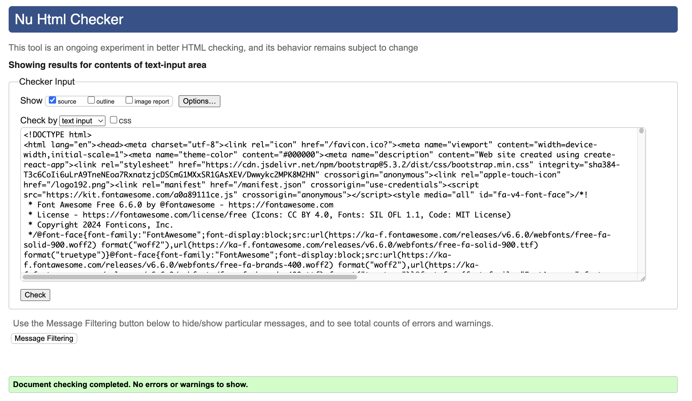

# Testing

**Table of content**
- [Browser compatibility testing](#browser-compatibility)
- [Responsiveness testing](#responsiveness)
- [Manual testing](#manual-testing)
    - [Manual testing of core functionality](#manual-test-functionality)
    - [Manual testing of user stories](#user-story-testing)
- [Automated tests](#automated-tests)
    - [Django unit tests](#unittests)
    - [Jest tests for JavaScript](#jest-tests)
- [Lighthouse tests](#lighthouse)
- [Validation of HTML](#html-validation)
- [Validation of CSS](#css-validation)
- [Linting of Python code](#python-lint)
- [Linting of JavaScript code](#js-lint)

## Browser compatibility testing

Chrome

Safari

Microsoft Edge

Firefox

## Responsiveness testing

## Manual testing TBC

### Manual testing of core functionality TBC

### Manual testing of user stories WIP

## Automated tests

### Django unit tests

 

Click for details relating to Django rest unit tests

### Jest tests

Click for details relating to Jest tests

## Lighthouse tests

Click to see screenshots of test results on mobile

Click to see screenshots of test results on desktop

## Validation of HTML

All pages were validated using [W3C's Markup Validation Service](https://validator.w3.org/nu/), with no errors or warnings.

Due to how React renders HTML elements, it did not make much sense to validate by URL. Instead, I have taken the following steps for each page on the website:

1. Inspect the page
1. Right-click on the HTML tag and select "Edit as HTML" in the "Elements" tab.
    - 
1. Copy all of the rendered HTML.
    -  
1. Validate by direct input in the validation tool.
    - 

This allowed for the validation of conditionally rendered HTML.

Since the screenshot does not indicate which page is being validated, I will not include a screenshot per page.

The following pages were validated, with no errors or warnings:

- "/" - Discover (Home page)
- "/artpieces/:id/ Artpiece page
- "/profiles/:id/ Profile page
- "/profiles/:id/edit/ Profile edit page
- "/account/" Account admin page
- "/artpieces/create/" Artpiece creation page
- "/collections/create/" Collection creation page
- "/artpieces/:id/edit/" Artpiece edit page
- "/collections/:id/edit" Collection edit page
- "/enquiries/" Enquiries page
- "/liked/" Liked page 
- "/signin/" Sign in page
- "/signup/" Sign up page

## Validation of CSS

Click to see CSS validation details

## Linting of Python code

## Linting of JS and JSX code

Click to see screenshots of linting results per file

